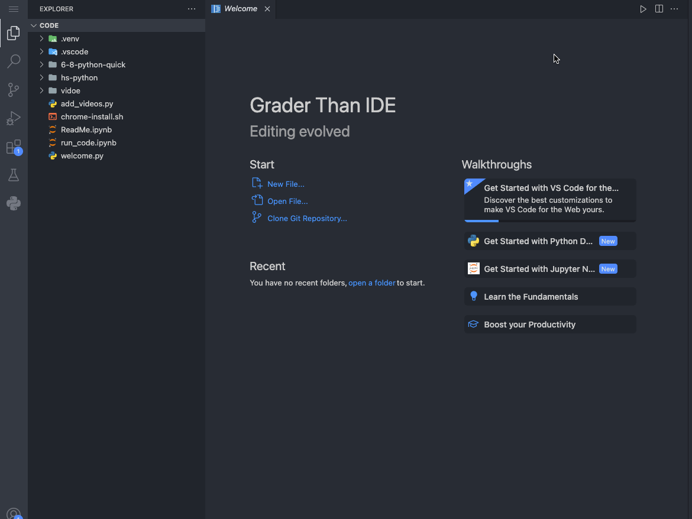

# Printing in Python 🐍

*Python Basics 01*

*Special thank you to Kerri Murphy*

---

## 📚 What will we learn?

- How to run Python code?
- How to print out strings?
- How to print sting variables?

---

## 🚀 Starting with Grader Than Workspace IDE

- Open Grader Than Workspace IDE.
- Navigate to the folder `hs-python/01_basics`
- Open the notebook `01_printing.ipynb`
- Click on the play ▶️ button to run the notebook cells.

<!-- 
- This slide introduces students to the initial steps of using the Grader Than Workspace IDE, focusing on opening and running a notebook.
- Emphasize the importance of knowing how to navigate through the IDE to find and open the required notebook.
- Highlight the simplicity of running code by using the play button, encouraging students to actively engage with the code by running it themselves.
-->

---

<!-- _footer: ""  -->
<!-- _header: "" -->

## 🚀 Opening a Jupyter Notebook



---

## 🧵 What is a String?

- A string is a series of characters, like words or sentences, enclosed in quotes.

```py
"Hello world!"
```

<!-- 
- This slide explains the concept of a string in programming, emphasizing its nature as a sequence of characters.
- Use the example to show a string in action, reinforcing the idea that strings are enclosed in quotes.
-->

---
<!-- _footer: ""  -->
<!-- _header: "" -->

<video src="../media/printing.mp4" controls width="100%"></video>

<!-- 
[video]{../media/01_printing/printing.mp4}
-->

---

## 🖨️ Printing "Hello world!"

```python
print("Hello world!")
```

- `print()` is a function that displays the text or variable content in the console.
- `"Hello world!"` is a string we're printing out.

<!-- 
- This slide demonstrates the basic use of the `print()` function in Python to display text.
- Explain that the text inside the quotes is what gets printed out, introducing the concept of string literals.
-->

---

## 📦 What is a String Variable?

- A variable is used to store information.
- A string variable stores text.

```python
name = "Tony"
print(name)
```

- This code assigns the string `"Tony"` to the variable `name`, then prints it.

<!-- 
- Introduce the concept of variables as containers for storing data.
- Explain how a string variable specifically stores text, using a simple assignment and print statement to illustrate.
-->

---


<!-- _footer: ""  -->
<!-- _header: "" -->

<video src="../media/with_variables_comma.mp4" controls width="100%"></video>

<!-- 
[video]{../media/01_printing/with_variables_comma.mp4}
-->

---

## 🤔 Printing with Variables

- What if you want to include additional words with your variable in a print statement?

```python
name = "Stark"
print("Tony name")
```

- This prints exactly: `Tony name`
- Why? The text is taken literally, not recognizing `name` as a variable.

<!-- 
- This slide addresses a common beginner mistake of trying to print a variable by simply including its name within a string literal.
- Emphasize that the print statement doesn't interpret "name" as a variable when it's inside quotes, leading to the literal output "Hello name" instead of substituting the variable's value.
- Use this as an opportunity to introduce the concept of string concatenation or formatting as a way to correctly include variables within output strings.
-->

---

## 🛠 Fixing the Print Statement

- To correctly include a variable with text, don't put the variable name inside quotes:

```python
name = "Stark"
print("Tony", name)
```

- This will print: `Tony Stark`

<!-- 
- Use this as an opportunity to correct the misconception and introduce the correct ways to concatenate strings or use commas for printing.
-->

---


<!-- _footer: ""  -->
<!-- _header: "" -->

<video src="../media/string_concatenation.mp4" controls width="100%"></video>

<!-- 
[video]{../media/01_printing/string_concatenation.mp4}
-->

---

## ✨ String Concatenation Magic

```python
name = "Iron"
print(name + "man")
```

- This prints: `Ironman`
- There no space between "Iron" and "man"?
- Concatenation with `+` joins strings exactly as they are, without adding spaces.

<!-- 
- This slide introduces the concept of string concatenation using the `+` operator as a way to join text with variable values.
- Explain that concatenation directly combines the strings without any additional characters, such as spaces, leading to the output "HelloBruce".
- Highlight the importance of explicitly adding spaces when using concatenation to ensure the output is formatted as intended.
-->

---

## 🍳 Cooking with Code

- Use the assigned project in Grader Than Feedback at `auto.graderthan.com`
- Craft a recipe for your favorite meal using `print` statements.
- Utilize variables to hold your ingredients list.
- Incorporate these variables within `print` statements to detail the recipe creation steps.

<!-- 
- This slide encourages students to apply programming to real-life scenarios, such as writing a recipe.
- The code example demonstrates how to use variables to store ingredient information, showing practical applications of variables.
- Encourages students to think creatively about how code can be used to organize and present information, reinforcing the use of `print` statements for output.
-->
